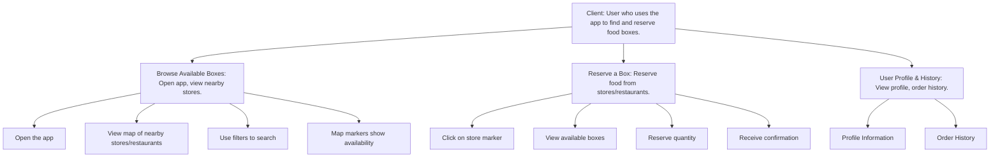

Client Journey Diagram:



Stores & Restaurants Journey Diagram:

```mermaid
graph TD
    A[Food Providers: Stores/restaurants with excess food.] --> B[Identify Excess Food: Determine available food.]
    B --> B1[Log in to the app]
    B --> B2[Choose pickup date]
    B --> B3[Select volunteer organization]
    B --> B4[Specify food box quantity]
    B --> B5[Confirm donation]
    A --> C[Box Management: Manage food boxes for donation.]
    C --> C1[Manage available boxes]
    C --> C2[Update box details]
    A --> D[Admin Dashboard: Manage reservations, pickup, and donations.]
    D --> D1[View Reservations]
    D --> D2[View Pickup Schedule]
    D --> D3[Manage Donations]
