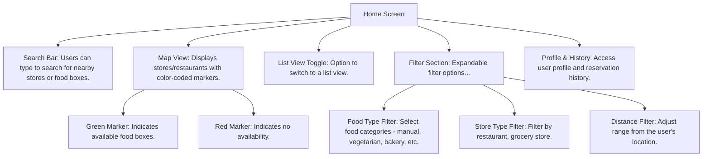
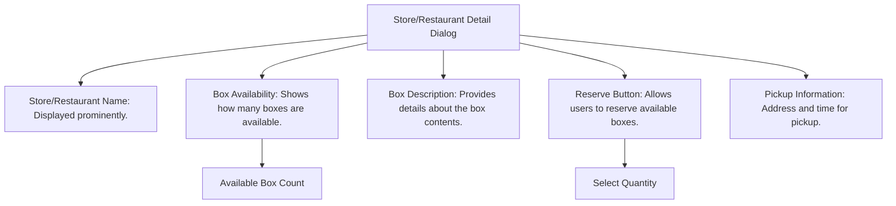
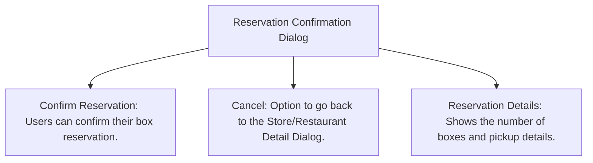
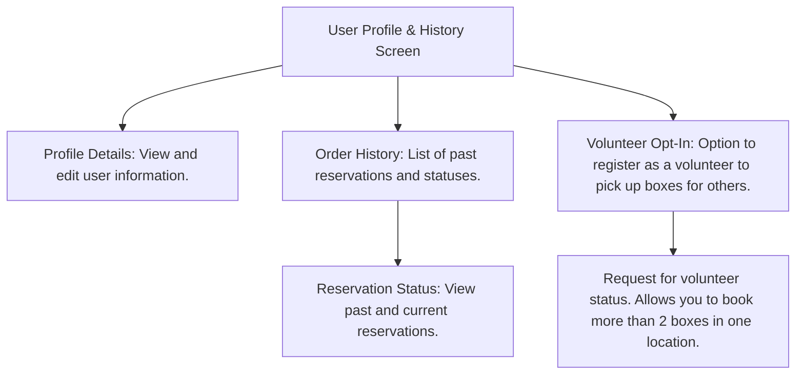
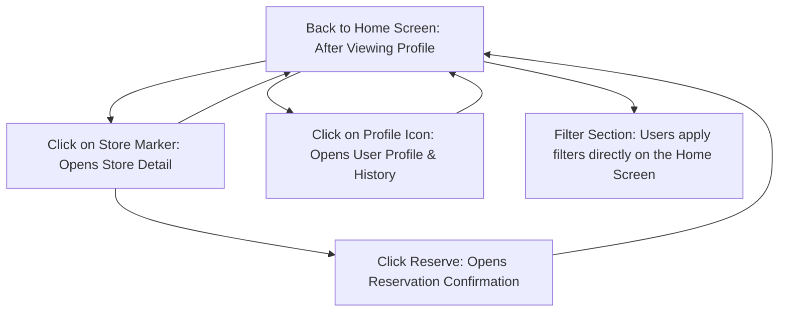

1. Home Screen Flow

2. Store/Restaurant Detail Dialog Flow

3. Reservation Confirmation Dialog Flow

4. User Profile & History Screen Flow

Interaction Flow Diagram with Transitions

# Explanation of the Transitions

## 1. From Home Screen:
- **To Store/Restaurant Detail Dialog:**
  - When the user clicks on a store or restaurant marker on the map, the **Store/Restaurant Detail Dialog** opens.
  
- **To User Profile & History Screen:**
  - When the user clicks on the profile icon, the **Profile & History Screen** opens, allowing them to view or edit their profile and reservation history.
  
- **Using the Integrated Filter Section:**
  - The filter section is part of the **Home Screen**, so users can apply filters directly without opening a separate dialog.

## 2. From Store/Restaurant Detail Dialog:
- **To Reservation Confirmation Dialog:**
  - When the user clicks the **Reserve** button, they are taken to the **Reservation Confirmation Dialog** to confirm their booking.
  
- **Back to Home Screen:**
  - If the user navigates back, they return to the **Home Screen** (either map or list view).

## 3. From Reservation Confirmation Dialog:
- **Back to Home Screen:**
  - After confirming a reservation, the user is directed back to the **Home Screen**.

## 4. From User Profile & History Screen:
- **Back to Home Screen:**
  - After viewing or editing their profile, the user can return to the **Home Screen**.
 

------------

Questions for discussion:

- think about the differences between the profiles of a regular user and a store/restaurant in order to unify the application as much as possible. For example, notifications about an order from a regular user and notifications about an ordered food box from a food distributor are similar.

- it would be appropriate for a store/restaurant user to provide the ability to automatically generate food boxes for the period Monday-Saturday (before the weekend, food leftovers may be higher than usual). In this case, the store gets more automation and its task will be reduced only to preparing the required number of ordered boxes, which cannot exceed the daily limit.

- the issue of replenishing the balance/automatically assigning a conditional balance of 20-50 euros to the user.
...
