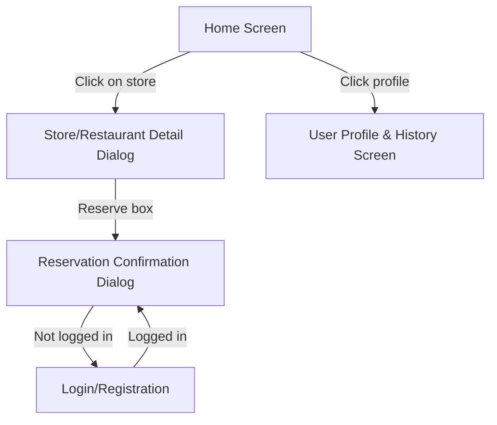
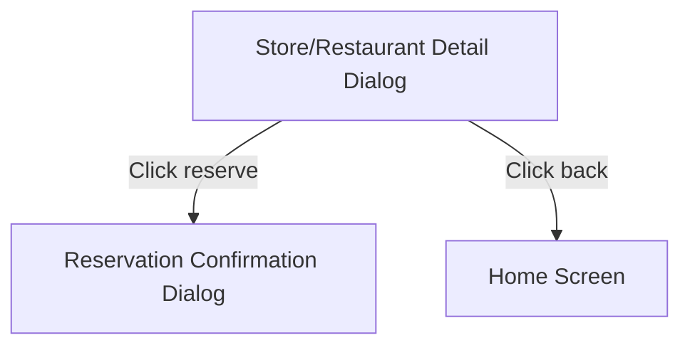
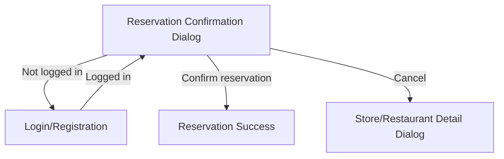
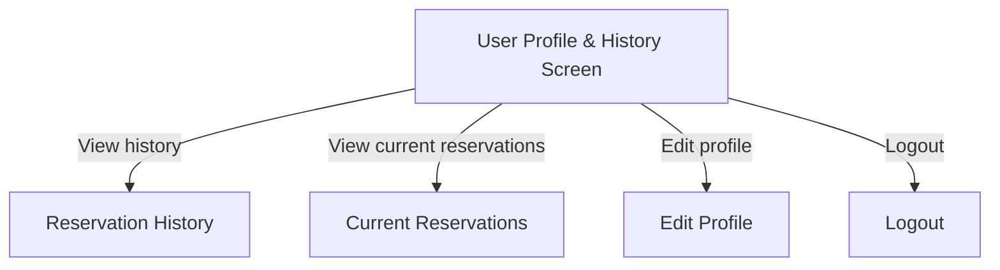
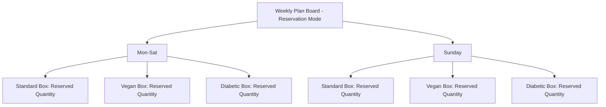
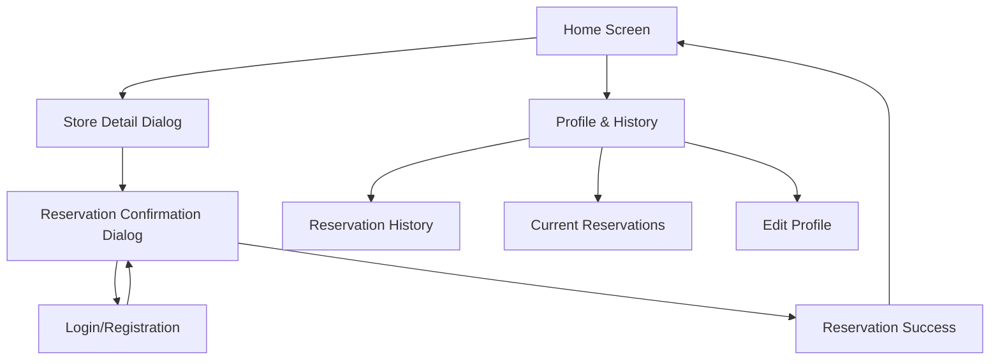

# Concept Interfaces

This document describes the main concepts of the user interface for **CareFood** both for **User-Seekers** and **Providers**.

## Table of Contents

1. [Home Screen Flow (User-Seeker)](#1-home-screen-flow-user-seeker)
2. [Store/Restaurant Detail Dialog Flow (User-Seeker)](#2-storerestaurant-detail-dialog-flow-user-seeker)
3. [Reservation Confirmation Dialog Flow (User-Seeker)](#3-reservation-confirmation-dialog-flow-user-seeker)
4. [User Profile & History Screen Flow (User-Seeker)](#4-user-profile--history-screen-flow-user-seeker)
5. [Weekly Plan & Reservation Flow (Provider)](#5-weekly-plan--reservation-flow-provider)
6. [Interaction Flow Diagram with Transitions](#6-interaction-flow-diagram-with-transitions)
7. [Explanation of the Transitions](#7-explanation-of-the-transitions)

---

### 1. Home Screen Flow (User-Seeker)

[Back to top](#table-of-contents)

### 2. Store/Restaurant Detail Dialog Flow (User-Seeker)

[Back to top](#table-of-contents)

### 3. Reservation Confirmation Dialog Flow (User-Seeker)

[Back to top](#table-of-contents)

### 4. User Profile & History Screen Flow (User-Seeker)

[Back to top](#table-of-contents)

### 5. Weekly Plan & Reservation Flow (Provider)

[Back to top](#table-of-contents)

### 6. Interaction Flow Diagram with Transitions

[Back to top](#table-of-contents)

### 7. Explanation of the Transitions

1. **Home Screen (User-Seeker)**:
    - The user opens the application and is presented with the home screen, displaying a list of stores and restaurants that offer food boxes.
    - Each entry in the list shows the name, address, and number of available boxes.
    - If the user clicks on a store/restaurant, they are taken to the **Store/Restaurant Detail Dialog**.

2. **Store/Restaurant Detail Dialog (User-Seeker)**:
    - Upon selecting a store/restaurant, the user can see more detailed information, including the categories of food boxes available (Standard, Vegan, Diabetic) and the respective quantities.
    - The user can click a “Reserve” button for a box, which triggers the **Reservation Confirmation Dialog**.
    - If the user is not logged in, they will be prompted to either **Log In** or **Register**.

3. **Reservation Confirmation Dialog (User-Seeker)**:
    - If the user confirms their reservation, the system checks if they are logged in.
    - If logged in, the reservation is confirmed, and the system updates the available number of boxes for the store.
    - If not logged in, they are redirected to the **Log In** or **Register** dialog.

4. **User Profile & History Screen**:
    - After logging in, users can access their profile and see a list of their reserved boxes under the "Reservation History" section.
    - Users can also update their preferences (Standard, Vegan, Diabetic), which filters available stores/restaurants on the home screen.
  
5. **Filter & Search Dialog**:
    - The user can filter the list of stores/restaurants based on box preferences (Standard, Vegan, Diabetic).
    - When filters are applied, the home screen list updates dynamically to match the selected criteria.

6. **Weekly Plan & Reservation Flow (Provider)**:
    - Providers (store/restaurant staff) log in and access their weekly plan board.
    - In **Plan Mode**, providers input the number of food boxes they will offer for each day of the week.
    - In **Reservation Mode**, providers can see the reservations made by users and the remaining availability for each day.
    - For example, if 5 boxes are available and 3 are reserved, the board will show "3/5".
    - Providers can prepare the necessary number of boxes according to user reservations, ensuring that no more boxes are reserved than available in the plan.

[Back to top](#table-of-contents)
