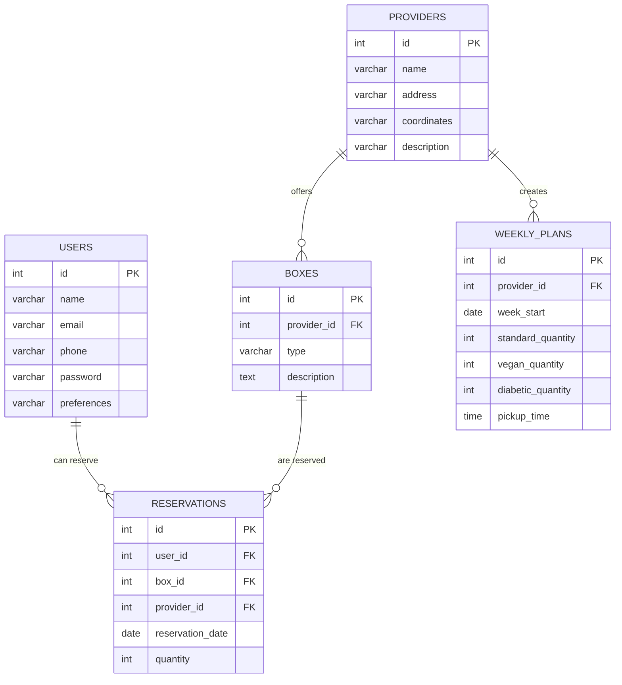

# DataBase

## Table of Contents

1. [Entity Relationship Diagram](#entity-relationship-diagram)
2. [Database Creation SQL](#database-creation-sql)
3. [Data Insertion Example](#data-insertion-example)
4. [Examples of SQL-queries](#examples-of-sql-queries)

---

### Entity Relationship Diagram

This document outlines the structure of the CareFood project database, using MySQL. It includes entity relationships, sample SQL queries for database creation, and an explanation of user access for team members.



[Back to top](#table-of-contents)

---

### Database Creation SQL

1. You can use sql-file for create database on local PC:

[carefood.sql](/planning/carefood.sql)

```
mysql -u "root" -p < carefood.sql
```

enter your password when asked

2. Here are the SQL queries needed to create the database structure for the CareFood project.

Create the database:

```sql
CREATE DATABASE carefood;
```

Use the database:

```sql
USE carefood;
```

Create users table

```sql
CREATE TABLE users (
    id INT AUTO_INCREMENT PRIMARY KEY,
    name VARCHAR(100) NOT NULL,
    email VARCHAR(100),
    phone VARCHAR(20),
    password VARCHAR(100) NOT NULL,
    preferences VARCHAR(20)
);
```

Create providers table

```sql
CREATE TABLE providers (
    id INT AUTO_INCREMENT PRIMARY KEY,
    name VARCHAR(100) NOT NULL,
    address VARCHAR(255) NOT NULL,
    coordinates VARCHAR(100),
    description TEXT
);
```

Create boxes table:

```sql
CREATE TABLE boxes (
    id INT AUTO_INCREMENT PRIMARY KEY,
    provider_id INT,
    type VARCHAR(20),
    description TEXT,
    FOREIGN KEY (provider_id) REFERENCES providers(id)
);
```

Create weekly plans table:

```sql
CREATE TABLE weekly_plans (
    id INT AUTO_INCREMENT PRIMARY KEY,
    provider_id INT,
    week_start DATE,
    standard_quantity INT,
    vegan_quantity INT,
    diabetic_quantity INT,
    pickup_time TIME,
    FOREIGN KEY (provider_id) REFERENCES providers(id)
);
```

Create reservations table:

```sql
CREATE TABLE reservations (
    id INT AUTO_INCREMENT PRIMARY KEY,
    user_id INT,
    box_id INT,
    provider_id INT,
    reservation_date DATE,
    quantity INT,
    FOREIGN KEY (user_id) REFERENCES users(id),
    FOREIGN KEY (box_id) REFERENCES boxes(id),
    FOREIGN KEY (provider_id) REFERENCES providers(id)
);
```

[Back to top](#table-of-contents)

---

### Data Insertion Example


Here are sample SQL queries for inserting data for three food providers, two user accounts, and weekly plans starting from September 9, 2024

Insert providers:

```sql
INSERT INTO providers (name, address, coordinates, description)
VALUES 
('Lidl', 'Rue Gray 138, 1050 Ixelles', '50.833, 4.366', 'Discount supermarket chain.'),
('Lidl', 'Rue des Coteaux 40, 1030 Schaerbeek', '50.860, 4.383', 'Discount supermarket chain.'),
('Aldi', 'Rue de Intendant 53, 1080 Molenbeek-Saint-Jean', '50.860, 4.320', 'Discount supermarket chain.');
```

Insert box descriptions:

```sql
INSERT INTO boxes (provider_id, type, description)
VALUES
(1, 'Standard', 'Includes meat or fish products, frozen or fresh, mushrooms, vegetables, fruits, pasta, sauces.'),
(1, 'Vegan', 'Includes only plant-based items: vegetables, fruits, grains, pasta, sauces.'),
(1, 'Diabetic', 'Includes diabetic-friendly items: whole grains, vegetables, low-sugar products.'),
(2, 'Standard', 'Includes meat or fish products, frozen or fresh, mushrooms, vegetables, fruits, pasta, sauces.'),
(2, 'Vegan', 'Includes only plant-based items: vegetables, fruits, grains, pasta, sauces.'),
(2, 'Diabetic', 'Includes diabetic-friendly items: whole grains, vegetables, low-sugar products.'),
(3, 'Standard', 'Includes meat or fish products, frozen or fresh, mushrooms, vegetables, fruits, pasta, sauces.'),
(3, 'Vegan', 'Includes only plant-based items: vegetables, fruits, grains, pasta, sauces.'),
(3, 'Diabetic', 'Includes diabetic-friendly items: whole grains, vegetables, low-sugar products.');
```

Insert users:

```sql
INSERT INTO users (name, email, phone, password, preferences)
VALUES 
('John Smith', 'john@example.com', '123456789', 'u123456', 'Standard'),
('Anna White', 'anna@example.com', '987654321', 'u123456', 'Vegan');
```

Insert weekly plans for September 2024:

```sql
INSERT INTO weekly_plans (provider_id, week_start, standard_quantity, vegan_quantity, diabetic_quantity, pickup_time)
VALUES

-- Lidl at Rue Gray 138
(1, '2024-09-09', 8, 3, 1, '17:30:00'),
(1, '2024-09-10', 8, 3, 1, '17:30:00'),
(1, '2024-09-11', 8, 3, 1, '17:30:00'),
(1, '2024-09-12', 8, 3, 1, '17:30:00'),
(1, '2024-09-13', 8, 3, 1, '17:30:00'),
(1, '2024-09-14', 10, 4, 2, '17:30:00'),
-- next week
(1, '2024-09-16', 8, 3, 1, '17:30:00'),
(1, '2024-09-17', 8, 3, 1, '17:30:00'),
(1, '2024-09-18', 8, 3, 1, '17:30:00'),
(1, '2024-09-19', 8, 3, 1, '17:30:00'),
(1, '2024-09-20', 8, 3, 1, '17:30:00'),
(1, '2024-09-21', 10, 4, 2, '17:30:00'),
-- next week
(1, '2024-09-23', 8, 3, 1, '17:30:00'),
(1, '2024-09-24', 8, 3, 1, '17:30:00'),
(1, '2024-09-25', 8, 3, 1, '17:30:00'),
(1, '2024-09-26', 8, 3, 1, '17:30:00'),
(1, '2024-09-27', 8, 3, 1, '17:30:00'),
(1, '2024-09-28', 10, 4, 2, '17:30:00'),

-- Lidl at Rue des Coteaux 40
(2, '2024-09-09', 8, 3, 1, '17:30:00'),
(2, '2024-09-10', 8, 3, 1, '17:30:00'),
(2, '2024-09-11', 8, 3, 1, '17:30:00'),
(2, '2024-09-12', 8, 3, 1, '17:30:00'),
(2, '2024-09-13', 8, 3, 1, '17:30:00'),
(2, '2024-09-14', 10, 4, 2, '17:30:00'),
-- next week
(2, '2024-09-16', 8, 3, 1, '17:30:00'),
(2, '2024-09-17', 8, 3, 1, '17:30:00'),
(2, '2024-09-18', 8, 3, 1, '17:30:00'),
(2, '2024-09-19', 8, 3, 1, '17:30:00'),
(2, '2024-09-20', 8, 3, 1, '17:30:00'),
(2, '2024-09-21', 10, 4, 2, '17:30:00'),
-- next week
(2, '2024-09-23', 8, 3, 1, '17:30:00'),
(2, '2024-09-24', 8, 3, 1, '17:30:00'),
(2, '2024-09-25', 8, 3, 1, '17:30:00'),
(2, '2024-09-26', 8, 3, 1, '17:30:00'),
(2, '2024-09-27', 8, 3, 1, '17:30:00'),
(2, '2024-09-28', 10, 4, 2, '17:30:00'),

-- Aldi at Rue de Intendant 53
(3, '2024-09-09', 8, 3, 1, '17:30:00'),
(3, '2024-09-10', 8, 3, 1, '17:30:00'),
(3, '2024-09-11', 8, 3, 1, '17:30:00'),
(3, '2024-09-12', 8, 3, 1, '17:30:00'),
(3, '2024-09-13', 8, 3, 1, '17:30:00'),
(3, '2024-09-14', 10, 4, 2, '17:30:00'),
-- next week
(3, '2024-09-16', 8, 3, 1, '17:30:00'),
(3, '2024-09-17', 8, 3, 1, '17:30:00'),
(3, '2024-09-18', 8, 3, 1, '17:30:00'),
(3, '2024-09-19', 8, 3, 1, '17:30:00'),
(3, '2024-09-20', 8, 3, 1, '17:30:00'),
(3, '2024-09-21', 10, 4, 2, '17:30:00'),
-- next week
(3, '2024-09-23', 8, 3, 1, '17:30:00'),
(3, '2024-09-24', 8, 3, 1, '17:30:00'),
(3, '2024-09-25', 8, 3, 1, '17:30:00'),
(3, '2024-09-26', 8, 3, 1, '17:30:00'),
(3, '2024-09-27', 8, 3, 1, '17:30:00'),
(3, '2024-09-28', 10, 4, 2, '17:30:00');
```

[Back to top](#table-of-contents)

### Examples of SQL-queries

1. **Checking available boxes for a specified day (2024-09-10)**

* Query for one store (eg provider_id = 1):

```sql
SELECT 
  provider_id, 
  week_start, 
  standard_quantity, 
  vegan_quantity, 
  diabetic_quantity, 
  pickup_time
FROM 
  weekly_plans
WHERE 
  provider_id = 1 AND week_start = '2024-09-10';
```

result:

```diff
provider_id | week_start | standard_quantity | vegan_quantity | diabetic_quantity | pickup_time
------------|------------|-------------------|----------------|-------------------|-------------
1           | 2024-09-10 | 8                 | 3              | 1                 | 17:30:00
```

#### Query for all stores:

```sql
SELECT 
  provider_id, 
  week_start, 
  standard_quantity, 
  vegan_quantity, 
  diabetic_quantity, 
  pickup_time
FROM 
  weekly_plans
WHERE 
  week_start = '2024-09-10';
```

result:

```diff
provider_id | week_start | standard_quantity | vegan_quantity | diabetic_quantity | pickup_time
------------|------------|-------------------|----------------|-------------------|-------------
1           | 2024-09-10 | 8                 | 3              | 1                 | 17:30:00
2           | 2024-09-10 | 8                 | 3              | 1                 | 17:30:00
3           | 2024-09-10 | 10                | 4              | 2                 | 17:30:00
```

2. **Added a reservation by user John Smith for a standard box on 2024-09-10 in store 1**

```sql
INSERT INTO reservations (user_id, provider_id, box_id, reservation_date, quantity)
VALUES ((SELECT id FROM users WHERE name = 'John Smith'), 1, 1, '2024-09-10', 1);
```

3. **Updating the number of reserved boxes**

After reserving, we update the data on the number of available boxes (reduce by 1):

```sql
UPDATE weekly_plans
SET standard_quantity = standard_quantity - 1
WHERE provider_id = 1 AND week_start = '2024-09-10';
```

[We check the data update, taking into account the reserve](#query-for-all-stores)

[Back to top](#table-of-contents)

---

You can delete the database on your computer and recreate it by following all the steps above in this document.

#### Before deleting, make a backup copy of your current database before deleting:

```
mysqldump carefood -u root -p > carefood_240909.sql
```
enter your password when asked

Delete database carefood on you PC:

```sql
DROP DATABASE carefood;
```
